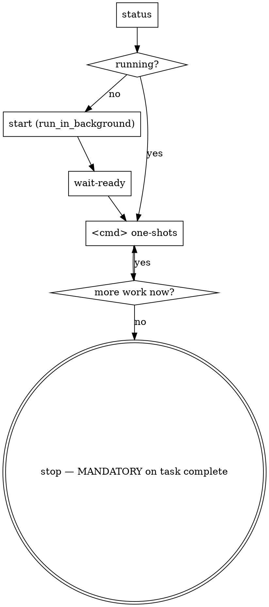

# NativeWright

One principle: **route every browser automation action through the shared NativeWright daemon. Never use ad-hoc browser automation.**

NativeWright wraps Patchright — a stealth-patched Playwright fork — in a long-lived HTTP daemon, so AI coding agents (Claude Code, Cursor, Codex, Gemini CLI) can drive a single real Chrome with a persistent profile across many one-shot shell calls.

## When to use this skill

Use this skill when the task involves:
- Opening any site that renders content via JavaScript (SPAs, React/Vue/Svelte apps).
- Interacting with a real UI: clicking, typing, selecting, submitting forms, uploading files.
- Visiting a site that requires login or session cookies.
- Capturing screenshots, HTML, or DOM for evidence.
- Stepping through a multi-step flow (checkout, wizard, generator).
- Monitoring browser-side console or network traffic.

## When NOT to use

Prefer lighter tools instead when:
- The site returns the needed data in static HTML or a JSON API (use `WebFetch` or plain `curl`).
- You only need a fact lookup (use `WebSearch`).
- You are inspecting HTML files on disk (use `Read`).
- You need to compare pure text content and the page has no JS (use `WebFetch`).

Rule of thumb: launching a browser is expensive. Skip it when a plain HTTP request suffices.

## Locating the script

The daemon self-registers its absolute path on every `start`. Read it from the platform-default install pointer:

| OS | Install pointer |
|---|---|
| Windows | `%LOCALAPPDATA%\NativeWright\install.json` |
| macOS | `~/Library/Application Support/NativeWright/install.json` |
| Linux/BSD | `${XDG_DATA_HOME:-~/.local/share}/nativewright/install.json` |

The `scriptPath` field resolves to `browser.js`. If you installed globally via `npm install -g nativewright`, the bin `nativewright` is on PATH and you can call it directly.

If nothing is installed yet:

```bash
npm install -g nativewright
npx patchright install chrome        # or: chromium
nativewright start             # run once to self-register; then stop
```

Always reference the binary by `nativewright` (if on PATH) or the resolved `scriptPath`. Never hardcode paths.

## Lifecycle in an agent session



### Check before starting

```bash
nativewright status
```

If `running: true`, the daemon already holds Chrome with a warm profile — reuse it, don't start a new one.

### Start (only if not running)

From Claude Code, ALWAYS launch the daemon in the background:

```
Bash(command='nativewright start', run_in_background=true)
```

Immediately follow with a synchronous wait so subsequent commands don't race startup:

```bash
nativewright wait-ready --timeout=30000
```

`wait-ready` exits 0 as soon as the HTTP server accepts the ping.

### Drive the browser

Every command is one-shot. Exit code 0 = `ok:true`, exit code 1 = `ok:false`. Output is always JSON.

```bash
nativewright goto https://example.com
nativewright text h1
nativewright click "button.submit"
nativewright fill "input[name=q]" "my query"
nativewright shot baseline
```

### Human-behavior layer (on by default)

Every interaction command (`click`, `dblclick`, `rightclick`, `fill`, `type`, `press`, `hover`, `scroll`, and the post-load idle of `goto`) routes through a realistic input synthesizer: cubic Bézier mouse paths, Fitts-like timing, log-normal keystroke cadence, real `page.mouse.wheel` ticks, etc. This is the default and what you want 99% of the time — it's the whole point of driving a real browser instead of a headless scraper.

**When to use `--raw=true`** (opt out):
- The element is invisible / offscreen and you just need the click dispatched.
- Scripted logins or scripted form fills where the ~600-1200 ms human typing would itself look suspicious (because *typing* a password at human speed looks like password guessing, whereas a paste happens instantly).
- You're benchmarking raw throughput or running a deterministic test suite where timing variance is noise.
- The target site does not have anti-bot (internal tools, test environments).

```bash
nativewright click ".hidden-toggle" --raw=true
nativewright fill "#api-token" "$TOKEN" --raw=true
```

**When to use `--seed=<int>`**:
- You want reproducible randomness across runs (same seed → same path / delays / typos).
- Useful for debugging a flaky selector: fix the randomness, isolate the bug.

```bash
nativewright click ".flaky-button" --seed=42
```

**Telemetry from `click` in human mode** — useful when debugging "my click didn't register":

```json
{
  "landedAt": { "x": 842, "y": 517 },
  "targetBox": { "x": 810, "y": 500, "width": 80, "height": 34 },
  "moveMs": 247,
  "totalMs": 389
}
```

**Default behaviour you should be aware of**:
- `goto` adds a 300-2000 ms "reading" pause after load before returning — real users don't fire the next action the instant `load` event fires.
- `fill` does a triple-click + Ctrl+A + Delete to clear, THEN types the new value at human cadence. This is slower than raw `page.fill()` but works on React-controlled inputs and contenteditables that reject programmatic fill.
- `type` clicks the field first (focus via real mouse event), waits, then types.
- Typo simulation (~0.8% per char) is **auto-disabled for password/OTP/CVV/PIN/secret/token fields** — the skill sniffs the focused element's `type`, `name`, `id`, `autocomplete` attributes.
- Scroll uses real wheel events and **stops automatically** when the page can't scroll further (edge-detection via `window.scrollY` stall).

### Stop — MANDATORY when the task is complete

<HARD-GATE>
When the browser-related task is done, you MUST call `stop`. Leaving Chrome running after the task is over, or closing it any other way (Ctrl+C on the background job, killing the PID, clicking the X), risks:
- cookies / localStorage / device tokens not being flushed to disk → next session shows you logged out;
- a stale profile lock in the user-data directory → next `start` fails with "profile already in use";
- zombie `chrome` processes holding RAM.

The ONLY correct way to finish:

```bash
nativewright stop
```

This gracefully closes the `BrowserContext` (Chrome flushes everything to disk), releases the profile lock, reaps child processes, and deletes the lockfile. The next `start` then opens the same profile with ALL login state intact.
</HARD-GATE>

**When NOT to stop yet**: if you're in the middle of a multi-step flow and will issue more commands in the same or next turn, keep the daemon running — don't stop between commands. Only stop when the **overall task** is complete.

**Decision rule**: before your final message to the user reporting the task is done, call `stop`. This should become reflex — if you're about to say "готово" / "done" / present the final artifact, the line above it should be the stop command.

## Command reference

All commands accept `--timeout=<ms>` (default 30000) and `--key=value` flags for any non-positional option. **All interaction commands additionally accept `--raw=true`** (opt out of the human-behavior layer) and `--seed=<int>` (reproducible randomness).

| Group | Command | Positional | Notes |
|---|---|---|---|
| Pages | `new` | — | opens a fresh page, makes it active, returns its index |
|  | `pages` | — | lists open pages with URLs |
|  | `switch <index>` | index | activates another page |
|  | `close-page` | — | closes the active page |
| Nav | `goto <url>` | url | `--waitUntil=load\|domcontentloaded\|networkidle`; human-mode adds post-load idle |
|  | `back` / `forward` / `reload` | — |  |
| Interact | `click <selector>` | selector | human Bézier path; `--raw=true`, `--button=left\|right\|middle`, `--clickCount=1\|2\|3` |
|  | `dblclick <selector>` | selector | double-click (clickCount=2) |
|  | `rightclick <selector>` | selector | right-button click |
|  | `fill <selector> <value>` | selector, value | human: triple-click clear + Ctrl+A fallback + typed cadence |
|  | `type <selector> <text>` | selector, text | human keystroke cadence; `--typos=on\|off\|auto` |
|  | `press <key>` | key | e.g. `Enter`, `Control+A`, `ArrowDown` |
|  | `hover <selector>` | selector | human mouse path to element |
|  | `select <selector> <value>` | selector, value | `<select>` option |
|  | `scroll <top\|bottom\|up\|down\|<px>>` | direction | human: real wheel ticks w/ edge-detection |
|  | `upload <selector> <path>` | selector, path | file input; absolute or cwd-relative |
| Wait | `wait <ms>` | ms | blind sleep (avoid when you can wait-for) |
|  | `wait-for <selector>` | selector | `--state=visible\|hidden\|attached\|detached` |
|  | `wait-for-load` | — | `--state=load\|domcontentloaded\|networkidle` |
| Read | `text [selector]` | selector? | inner text of element or body |
|  | `html [selector]` | selector? | outerHTML or full document |
|  | `title` / `url` | — |  |
|  | `get <selector> <attr>` | selector, attr | getAttribute |
|  | `count <selector>` | selector | number of matches |
|  | `eval <js>` | js | expression or statements; returns `{value}` |
|  | `cookies [--url=...]` | — | domain-scoped cookie dump |
| Frames | `frame <name>` | name | subsequent interaction commands target this frame |
|  | `frame --reset` | — | clear frame scope |
| Dialogs | `dialog <accept\|dismiss> [prompt]` | action, promptText? | policy for future alert/confirm/prompt |
| Artifacts | `shot [name]` | name? | PNG under artifactsDir |
|  | `save-artifact [name]` | name? | PNG + HTML + metadata JSON bundle |
|  | `downloads [--n=N]` | — | list captured downloads with auto-saved paths |
| Diagnostics | `console [--n=N]` | — | recent console.* messages |
|  | `network-log [--n=N]` | — | recent requests/responses |
|  | `state` | — | pages, active idx, command ring buffer |
| Viewport | `viewport <w> <h> --force` | w, h | stealth-risky; requires `--force` |

## Persistent profile

The profile lives under the platform-default data root (override via `NATIVEWRIGHT_USER_DATA_DIR`):

| OS | Default path |
|---|---|
| Windows | `%LOCALAPPDATA%\NativeWright\profile\default\` |
| macOS | `~/Library/Application Support/NativeWright/profile/default/` |
| Linux/BSD | `${XDG_DATA_HOME:-~/.local/share}/nativewright/profile/default/` |

Cookies, localStorage, and IndexedDB survive `stop`/`start`. Sessions on mature sites (Google, Microsoft) typically last ~2 weeks before device-token re-auth.

**Never open a normal Chrome window pointed at the same profile directory.** Chrome holds a profile lock; a second opener will fail or corrupt state. If the daemon `start` fails with a profile-lock error, a real Chrome (or a zombie NativeWright Chrome) is using the directory — stop the daemon, close Chrome, check `tasklist | findstr chrome` (Windows) or `pgrep -fl chrome` (Unix), then retry.

## First-run login

If the target site requires login and your profile has none yet, delegate to the `nativewright-login-bootstrap` skill — it codifies the manual-login dance exactly once per site.

## Debugging

- `nativewright status --verbose` dumps the last 20 commands with timings.
- `nativewright console` pulls captured `console.log/warn/error` from the active page (page events are suppressed by Patchright stealth; the script re-injects a hook on every navigation).
- `nativewright network-log` shows recent requests.
- The daemon log is at `$NATIVEWRIGHT_HOME/logs/daemon.log`.
- If a one-shot returns `ok:false`, the same daemon stays alive — you can immediately diagnose without restarting.
- Stale lockfile (`daemon.json` exists but `status` says `running:false`)? `nativewright start` will detect and reap it automatically.

## Common pitfalls

| Symptom | Cause | Fix |
|---|---|---|
| `daemon not running` | lockfile missing or stale | run `start` in background, then `wait-ready` |
| `ECONNREFUSED` on CLI | daemon crashed mid-command | `nativewright start` auto-reaps stale lockfile |
| `console` returns empty | no hook for the current page yet | after first `goto`/`reload`/`new` it will populate |
| Selector timeout | element hasn't rendered | prefer `wait-for <selector>` over blind `wait <ms>` |
| `profile lock` error on start | a Chrome already uses the profile | close that Chrome; check processes |
| `viewport` rejected | stealth guardrail | pass `--force=true` AND understand you're breaking stealth |

## Routing other skills through this one

When other skills need a browser, they **must** defer here. Never invent parallel browser logic. Never reach for Playwright directly. Never launch Chrome manually. Always go through `nativewright`.
